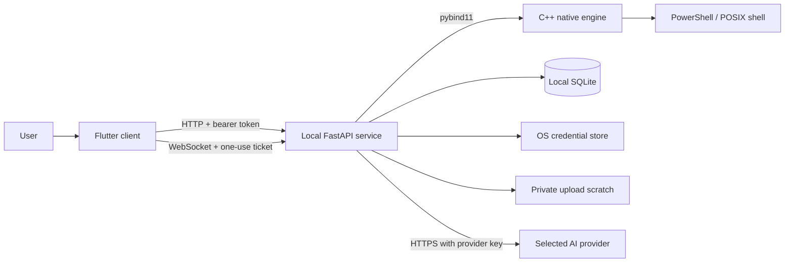
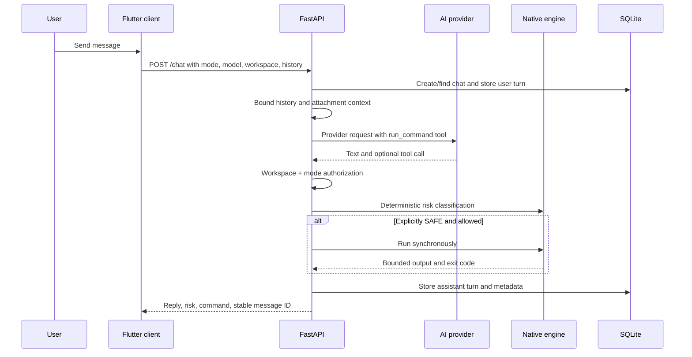
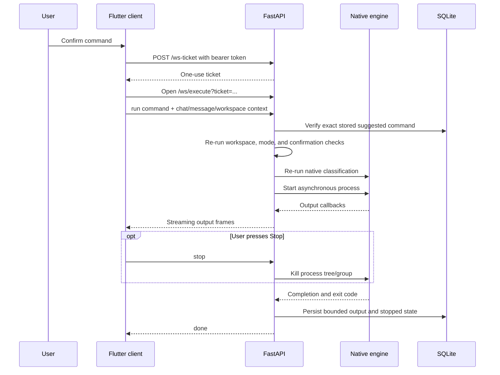

# AI Terminal Architecture

## 1. Purpose

AI Terminal converts natural-language requests into reviewed PowerShell commands while keeping execution authorization independent from the AI model. The architecture is local-first, single-user, and Windows-focused.

This document describes the implemented design. Planned changes belong in [ROADMAP.md](ROADMAP.md); architectural rationale belongs in [DECISIONS.md](DECISIONS.md).

## 2. Design principles

1. **The model is untrusted.** Model text and tool arguments are proposals, not authorization.
2. **Safety checks run server-side.** The Flutter UI is not a security boundary.
3. **Unknown is not safe.** Only commands on an explicit read-only allowlist may auto-run.
4. **Authorization is repeated at execution time.** Cached UI decisions are never trusted.
5. **Secrets fail closed.** Missing secure credential storage does not silently become plaintext storage.
6. **Local-only is an architectural constraint.** A remote/multi-user deployment requires a different threat model.
7. **Bounds are mandatory.** Uploads, context, history, captured output, and tickets have explicit limits.
8. **Security claims must match enforcement.** The workspace guard is not described as an OS sandbox.

## 3. System context

### Primary deployment

- Flutter runs as a native Windows desktop process.
- FastAPI listens on `127.0.0.1:8765` unless explicitly overridden.
- The native C++ Python module is loaded by the service.
- Provider traffic leaves the machine only when the user sends a model request.

### Development deployment

- Linux/macOS use the POSIX `forkpty` implementation.
- An optional Flutter Web bundle can be served by FastAPI on the same origin.
- Remote preview bootstrap is disabled unless explicitly enabled for development.

## 4. Component model

### 4.1 Flutter client (`client/`)

Responsibilities:

- render chats, models, settings, attachments, and execution output;
- collect Plan/Build mode and selected workspace;
- load the local token from disk in native builds;
- obtain same-origin bootstrap only in web builds;
- display server-provided risk and policy decisions;
- collect simple or typed confirmation;
- obtain a one-use WebSocket ticket;
- associate execution with a stable chat and assistant-message ID;
- cap live output retained in UI memory;
- send bounded user and assistant history to the service.

The client does **not** decide whether a command is safe. It may improve usability, but every security-relevant decision is repeated by the server.

### 4.2 FastAPI service (`server/app/`)

| Module | Responsibility |
|---|---|
| `main.py` | HTTP/WebSocket routes, orchestration, middleware, execution streaming |
| `security.py` | loopback/origin checks and one-use WebSocket ticket store |
| `config.py` | app paths, local token, keyring integration, custom-provider metadata |
| `models.py` | Pydantic request/response contracts and size limits |
| `ai_providers.py` | provider adapters, tool definitions, model discovery, bounded history |
| `execution_service.py` | shared authorization pipeline |
| `mode_policy.py` | strict Plan-mode command allowlist |
| `workspace_policy.py` | working-directory validation and common path-escape blocking |
| `engine_bridge.py` | Python interface to the native module |
| `chat_store.py` | SQLite chats, messages, metadata, and execution persistence |
| `uploads.py` | bounded uploads, sanitization, context extraction, and cleanup |
| `workspace.py` | folder browsing and selection validation |
| `model_catalog.py` | static model fallback metadata |

### 4.3 Native engine (`engine/`)

#### Risk classifier

`risk_classifier.hpp` evaluates normalized command text in this order:

1. permanently blocked patterns;
2. dangerous patterns;
3. confirmation-required patterns;
4. complete-command read-only allowlist;
5. default to `CONFIRM`.

The default is intentionally not `SAFE`.

#### PTY/ConPTY execution

- Windows launches `powershell.exe -NoLogo -NoProfile -NonInteractive -Command ...` through ConPTY.
- The process is assigned to a kill-on-close Windows Job Object.
- Linux/macOS launch `/bin/sh -c ...` through `forkpty` for development.
- POSIX termination targets the child process group.
- Synchronous capture is bounded.
- Asynchronous output is streamed through callbacks.

#### Python binding

`bindings.cpp` exposes:

- `RiskClassifier.classify`;
- synchronous `PtySession.run`;
- asynchronous `PtySession.start_async`;
- `PtySession.kill_execution`.

Background callbacks acquire the Python GIL before touching Python objects.

## 5. Trust boundaries

### Boundary A — user/client to local service

Controls:

- loopback bind by default;
- trusted Host middleware;
- explicit CORS allowlist;
- bearer token on protected HTTP endpoints;
- constant-time token comparison;
- bounded Pydantic input models;
- one-use WebSocket tickets;
- origin validation for WebSocket handshakes.

The token protects the local API from cross-origin browser access and accidental unauthenticated use. It is not a defense against a fully compromised process running as the same OS user.

### Boundary B — model/provider to execution

Provider output is untrusted. A tool call may contain a malicious or incorrect command. The command must pass workspace policy, mode policy, native risk classification, confirmation checks, and stored-command matching.

### Boundary C — uploaded content and command output to model context

Attachment text and terminal output may contain prompt injection. Attachment text is explicitly framed as untrusted user-provided data; terminal output is bounded, labelled in conversation context, and covered by the system instruction that output is untrusted. This reduces risk but does not guarantee semantic isolation; execution policy remains the final boundary.

### Boundary D — command process to operating system

The command runs with the current user's permissions. Job/process-group controls bound process lifetime, not filesystem, registry, device, or network access. The selected workspace is therefore not a complete sandbox.

### Boundary E — local service to provider

The selected provider receives conversation content required for the request and its API key. TLS validation is provided by the HTTP client. Custom provider URLs are user-configured and may point to local services.

## 6. Authentication and session design

### 6.1 Local bearer token

- Generated with `secrets.token_urlsafe(32)` on first run.
- Stored in `AITERM_HOME/local_api_token.txt` with restrictive permissions where supported.
- Read directly by the native client.
- Not printed to standard output.

### 6.2 Web bootstrap

A browser cannot read the native token file. `/local-token` exists for the same-origin local web client and requires:

- a loopback client address unless development override is enabled;
- a trusted Host header;
- an allowed or same origin.

This endpoint is not intended for remote deployment.

### 6.3 WebSocket ticket

Browsers cannot reliably attach a normal bearer header to a WebSocket handshake. The client therefore:

1. calls authenticated `POST /ws-ticket`;
2. receives a random ticket valid for 30 seconds;
3. places only that ticket in the WebSocket URL;
4. consumes it once during the handshake.

The long-lived bearer token does not enter WebSocket URLs or access logs.

## 7. Chat request flow

The current user turn and prior assistant turns are included. Aggregate provider context is bounded; old content may be truncated.

## 8. Confirmed execution flow

A client cannot substitute a different command while reusing a valid assistant-message ID.

## 9. Authorization algorithm

`execution_service.authorize` is the single shared path for chat auto-run, REST execution, and WebSocket execution.

### Step 1 — workspace policy

- require an existing readable working directory;
- require write access in Build mode;
- normalize the real directory;
- reject empty, NUL-containing, or multiline commands;
- reject parent traversal;
- reject UNC/device paths;
- reject common home/environment path indirection;
- reject absolute paths that do not start within the workspace.

### Step 2 — Plan policy

Plan mode accepts only one complete command on a conservative read-only allowlist. It rejects:

- redirection;
- pipes and chaining;
- command substitution;
- nested expressions/script blocks;
- environment/home expansion;
- unknown or mixed-behavior commands.

### Step 3 — native risk classification

- `BLOCKED`: reject permanently;
- `DANGEROUS`: require `user_confirmed=true` and the exact typed phrase;
- `CONFIRM`: require `user_confirmed=true`;
- `SAFE`: may proceed without confirmation.

### Step 4 — command binding

Confirmed REST/WebSocket execution must match the `suggested_command.command` stored on the referenced assistant message.

### Step 5 — execution

The normalized working directory—not an unvalidated client string—is passed to the native engine.

## 10. Workspace boundary

The policy blocks common explicit escape forms, but lexical inspection cannot prove the behavior of an arbitrary executable. Examples that require an OS-level sandbox to control completely include:

- a workspace script opening an external file;
- a compiler plugin writing to a user profile;
- a package manager changing global state;
- a reparse point or symlink targeting an external location;
- a process using registry, device, or network APIs.

The future design should move common file operations to structured brokered tools and run arbitrary commands in an enforceable restricted environment.

## 11. Provider abstraction

### Built-in providers

- OpenAI chat completions with function tools.
- Anthropic messages with tool use.
- Gemini generateContent with function declarations.

### Custom providers

A custom provider stores:

- stable slug/id;
- user-visible label;
- base URL;
- model IDs;
- API key in the credential store.

It is called through the OpenAI-compatible `/chat/completions` shape. The service first attempts tool calling. If the provider explicitly rejects tools, it retries once using a strict JSON response contract.

### Model discovery

- OpenAI: `GET /v1/models` with non-chat categories filtered.
- Anthropic: `GET /v1/models`.
- Gemini: model list filtered for `generateContent`.
- Custom provider: `GET {base_url}/models`.

Static metadata is a fallback when live discovery fails.

## 12. Storage model

### App directory

Default: `~/.ai-terminal`, configurable with `AITERM_HOME`.

Contents may include:

- `local_api_token.txt`;
- `chats.db` and SQLite WAL files;
- `uploads/` scratch files;
- `secrets.local.json` only when the explicit development fallback is enabled.

### SQLite

`chats` stores conversation metadata. `messages` stores role, content, timestamps, error state, and a JSON metadata object.

Assistant metadata may contain:

- active mode;
- suggested command and explanation;
- risk level and reason;
- automatic-execution flag;
- execution output and exit code;
- stopped state;
- blocked reason.

WAL mode and a busy timeout reduce local read/write contention.

### Upload lifecycle

- Maximum upload size: 25 MiB.
- Maximum text extracted per context file: 20,000 characters.
- Maximum aggregate attachment text per chat request: 60,000 characters.
- Maximum context attachments per chat request: 10.
- Context files are deleted after consumption or explicit discard.
- Abandoned context files older than 24 hours are removed at startup.
- Workspace uploads never overwrite an existing file silently.

## 13. Bounds and resource controls

| Resource | Bound |
|---|---:|
| Chat messages per request | 100 |
| Characters per message | 100,000 |
| Aggregate provider conversation context | 120,000 characters |
| Command length | 20,000 characters |
| Upload size | 25 MiB |
| Context extraction per file | 20,000 characters |
| Context attachments per request | 10 |
| Stored streamed execution output | 1,000,000 characters |
| Native synchronous captured output | 1 MiB plus truncation marker |
| WebSocket ticket lifetime | 30 seconds |
| Pending WebSocket tickets | 256 |

Live UI output is also capped to prevent unbounded client memory growth.

## 14. API surface

All routes except health, constrained web bootstrap, and static web assets require local authentication. WebSocket execution requires a one-use ticket.

| Method | Path | Purpose |
|---|---|---|
| `GET` | `/health` | local liveness |
| `GET` | `/local-token` | constrained same-origin web bootstrap |
| `POST` | `/ws-ticket` | issue one-use execution ticket |
| `GET` | `/providers/status` | configured providers and available models |
| `POST` | `/providers/api-key` | save built-in provider key |
| `DELETE` | `/providers/api-key/{provider}` | remove built-in provider key |
| `POST` | `/providers/custom` | add custom provider |
| `DELETE` | `/providers/custom/{provider_id}` | remove custom provider |
| `GET` | `/workspace/browse` | list directories for folder picker |
| `POST` | `/workspace/select` | validate selected folder |
| `POST` | `/uploads` | upload context/workspace file |
| `DELETE` | `/uploads/{upload_id}` | discard context scratch upload |
| `POST` | `/chat` | provider request and command proposal |
| `GET` | `/chats` | list conversations |
| `POST` | `/chats` | create conversation |
| `GET` | `/chats/{chat_id}` | load conversation |
| `PATCH` | `/chats/{chat_id}` | rename conversation |
| `DELETE` | `/chats/{chat_id}` | delete conversation |
| `POST` | `/execute` | one-shot authorized execution |
| `WS` | `/ws/execute` | streaming, stoppable execution |

## 15. Failure behavior

- Provider authentication, quota, model, network, and server failures become user-readable `ProviderError` messages.
- Unexpected provider errors return a generic message without a Python traceback.
- Missing keyring fails without writing plaintext unless explicit development fallback is enabled.
- Invalid workspace or path escape fails before native classification/execution.
- Native process-start failure is reported without leaking internal exception details.
- WebSocket disconnect requests process termination.
- History persistence failure does not strand the live execution state.
- Invalid or reused WebSocket tickets are rejected.

## 16. Concurrency model

- FastAPI handles local HTTP requests asynchronously.
- Provider requests use `httpx.AsyncClient`.
- Native asynchronous execution runs in a detached C++ thread.
- Callbacks hop back to the asyncio event loop with `call_soon_threadsafe`.
- A per-WebSocket send lock prevents interleaved frames.
- One active execution is allowed per WebSocket connection.
- SQLite opens short-lived connections with WAL and a busy timeout.

A future broker should provide a global execution scheduler and capability-aware concurrency limits.

## 17. Testing strategy

### Python

- Plan-mode bypass regression tests.
- Workspace/path policy tests.
- WebSocket ticket and origin tests.
- Keyring fail-closed tests.
- Upload sanitization and lifecycle tests.
- Chat execution-persistence tests.
- FastAPI + native PTY + WebSocket integration tests.

### Native

- Risk-classifier regression executable.
- PTY/ConPTY smoke executable.
- CTest integration.

### Flutter

- Mode-switch interaction test.
- Risk wire-value mapping test.

Planned CI and broader Windows/adversarial tests are listed in [ROADMAP.md](ROADMAP.md).

## 18. Known architectural gaps

- No enforceable filesystem/network/registry sandbox.
- No brokered capability model.
- No output secret-redaction layer.
- No append-only audit log.
- No schema migration framework.
- No packaged service lifecycle or signed update path.
- No snapshot/undo implementation.
- No rich document extraction.

These gaps are deliberate and documented; they must not be hidden by UI wording.
